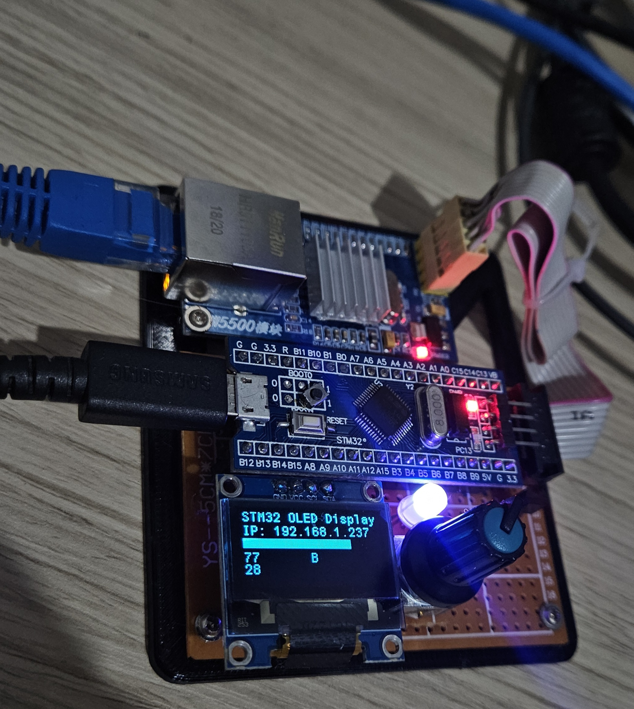

# STM32F103 + SSD1306 Display + Rotary Encoder + W5500 Ethernet

This repo contains the code used with the above setup. The goal is just experiment with the hardware available.

This board contains:
- STM32 BluePill (using CDC for debug)
- WizNet W5500
- I2C Display SSD1306
- RGB LED
- Rotary Encoder with center button
- LM35 temperature sensor
- I2C EEPROM 24C04 (under the display)

---

## Useful links
### Setup the display library
https://github.com/afiskon/stm32-ssd1306/tree/master - https://www.youtube.com/watch?v=97_Vyph9EzM

### Setup the W5500 library
https://github.com/Wiznet/ioLibrary_Driver - Wiznet ioLibrary_Driver
https://eax-me.translate.goog/stm32-w5500/?_x_tr_sl=ru&_x_tr_tl=en&_x_tr_hl=pt-BR&_x_tr_pto=wapp
https://www.micropeta.com/video109

The tutorial above is missing a call to `httpServer_time_handler` in the `SysTick_Handler`. Without it the code freezes in a while loop inside the http server.

### External interrupts
https://github.com/dekuNukem/STM32_tutorials/blob/master/lesson2_external_interrupt/README.md

### Serial port
`pyserial-miniterm /dev/ttyACM0`

To exit press Ctrl+]
